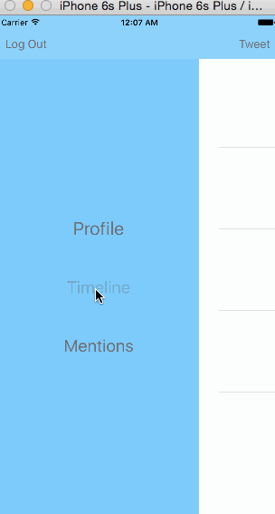

tter [(raw)](https://gist.githubusercontent.com/timothy1ee/b9b1860c8ecb4b0b1c18/raw/2adc3f63677d81644e00245cee891eee88907767/gistfile1.md)

This is a basic twitter app to read and compose tweets the [Twitter API](https://apps.twitter.com/).

Time spent: `15`

- 2 hrs to follow through video tutorials
- 3.5 hours to get the first 20 tweets showing decently with some kind of proto-design + color-scheme going on
- 7 hours to pretty much finish (one thing left) and then to lose all my work because I am an idiot
- 2 hours to get the detail view showing up with appropriate responses available (HORRIBLE view; at this point I'm late and I'm just getting it done. Shame level 10---I kept thinking this stupid README was a commit message and lost a crapton of work when everything went to hell)
- 1 hr to get same functionality on the main twitters feed

### Features

#### Required

- [x] User can sign in using OAuth login flow
- [x] User can view last 20 tweets from their home timeline
- [x] The current signed in user will be persisted across restarts
- [x] In the home timeline, user can view tweet with the user profile picture, username, tweet text, and timestamp.  In other words, design the custom cell with the proper Auto Layout settings.  You will also need to augment the model classes.
- [x] User can pull to refresh
- [x] User can compose a new tweet by tapping on a compose button.
- [x] User can tap on a tweet to view it, with controls to retweet, favorite, and reply.
- [x] User can retweet, favorite, and reply to the tweet directly from the timeline feed.

#### Optional

- [ ] When composing, you should have a countdown in the upper right for the tweet limit.
- [ ] After creating a new tweet, a user should be able to view it in the timeline immediately without refetching the timeline from the network.
- [ ] Retweeting and favoriting should increment the retweet and favorite count.
- [ ] User should be able to unretweet and unfavorite and should decrement the retweet and favorite count.
- [x] Replies should be prefixed with the username and the reply_id should be set when posting the tweet,
- [ ] User can load more tweets once they reach the bottom of the feed using infinite loading similar to the actual Twitter client.

### Awareness of Poor Points

- tab bar controller for the show detail rather than rando buttons
- alerts for success or failure on the main twitter page for the three pieces of functionality
- decisions related to private/public more consistent
- moving the rest of the API calls from the cell model to the tweetsViewController via the delegate
- any design. at all.

### Walkthrough

